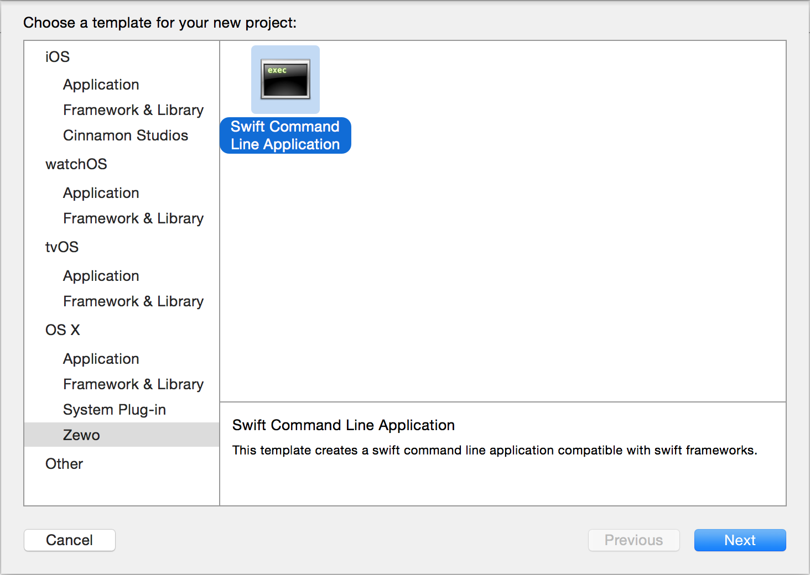
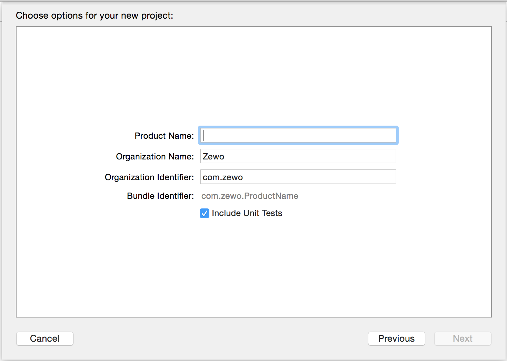
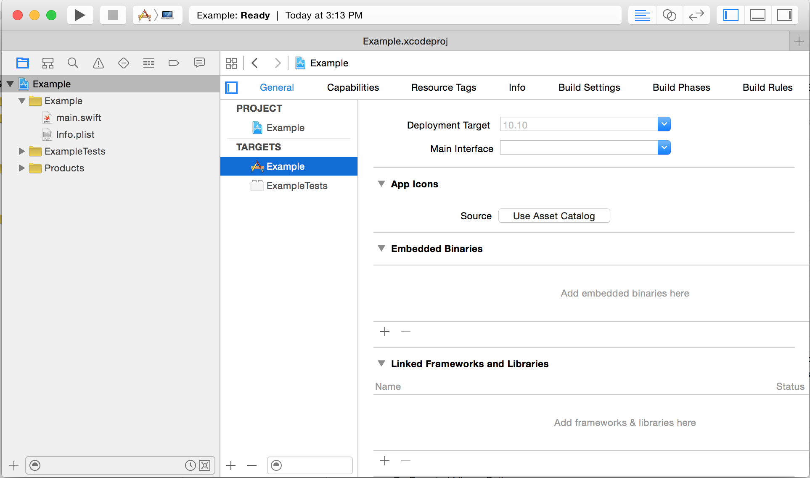

Swift Command Line Application Template
================================

[](https://developer.apple.com/swift/)
[](https://developer.apple.com/swift/)
[](https://github.com/Carthage/Carthage)
[](https://github.com/Carthage/Carthage)

The regular **Command Line Tool** template that comes with Xcode doesn't support *Swift Frameworks*. *Swift Applications* need a copy of the *Swift Standard Libraries* in their run path. The regular **Cocoa Application** template that comes with Xcode copies the *Swift Standard Libraries* to the app's bundle. But it also comes with storyboards and a lot of stuff that command line applications don't need.

The **Swift Command Line Application** template provides only what's needed to run a *Swift Application* using *Swift Frameworks*.

## Features

- [x] Supports **Swift Frameworks**
- [ ] Script that extracts the executable, swift standard libraries and frameworks from the app's bundle.

## Usage

- Open Xcode and press ⇧⌘9 or go to `File` > `New` > `Project`
- Select `OS X` > `Zewo` > `Swif Command Line Application`



- Press `Next`
- Type your `Product Name`, etc.



- Select directory and press `Create`
- `main.swift` will be entry point of your app


- To add **Swift Frameworks** select the project, app target, and on the `General` tab press `+` on the `Embedded Binaries` section.



- Select your frameworks
- That's it (:

## Installation

#### Alcatraz

Alcatraz is an open-source package manager for Xcode 5+. It lets you discover and install plugins, templates and color schemes without the need for manually cloning or copying files. It installs itself as a part of Xcode and it feels like home.

Install [Alcatraz](https://github.com/supermarin/Alcatraz) by running:

```bash
curl -fsSL https://raw.github.com/alcatraz/Alcatraz/master/Scripts/install.sh | sh
```

- With Xcode open press ⇧⌘9 or go to `Window` > `Package Manager` to open Alcatraz.
- Look for *Swift Command Line Application Template*.
- Click on the `INSTALL` button.
- Restart Xcode.


#### Manually
- Clone or download the repo. 
- Copy the `Project Templates` directory to `~/Library/Developer/Xcode/Templates`
- If the `~/Library/Developer/Xcode/Templates/Project Templates` directory already exists, copy the `Zewo` directory to it
- Restart Xcode.
